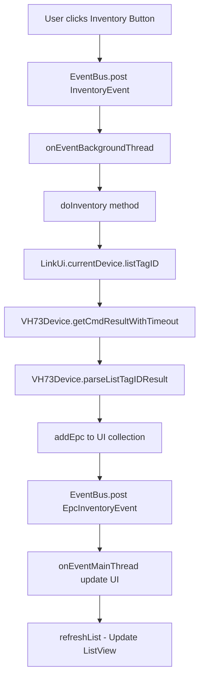

# FH75 SCAN RESULT ANALYSIS

## 📋 **TỔNG QUAN**
Phân tích về cách xử lý scan result và log data từ thiết bị FH75 handheld reader trong Android app.

**Ngày phân tích:** 2025-10-27  
**Log sample:** Session_20251025_164406 (Samsung SM-M325FV, Android 13)

---

## 🔧 **1. CLASSES XỬ LÝ SCAN RESULT**

### ⭐ **VH73Device.java** - Core Device Communication Class
**Đường dẫn:** `app/src/main/java/com/vanch/vhxdemo/VH73Device.java`

**Vai trò:** Class chính xử lý communication và parse dữ liệu từ thiết bị FH75

**Methods quan trọng:**
- `getCmdResult()` - Đọc kết quả từ thiết bị
- `getCmdResultWithTimeout(long maxTimeout)` - Đọc với timeout control
- `parseGetListTagIDResult(byte[] ret)` - Parse danh sách EPC tags từ raw data
- `parseListTagIDResult(byte[] ret)` - Parse kết quả inventory operation
- `listTagID(int no, int l)` - Gửi lệnh scan tags đến thiết bị
- `getListTagID(int no, int left)` - Lấy danh sách tags từ buffer

**Data parsing logic:**
```java
// Extract EPC từ response data
for (int i = 0; i < len; i++) {
    int ecpLen = data[index];
    byte[] epc = new byte[ecpLen * 2];
    System.arraycopy(data, index + 1, epc, 0, ecpLen * 2);
    epcs.add(epc);
    index = index + (ecpLen * 2) + 1;
}
```

---

### ⭐ **InventoryUI.java** - Main Scan UI Fragment
**Đường dẫn:** `app/src/main/java/com/vanch/vhxdemo/InventoryUI.java`

**Vai trò:** Fragment chính hiển thị và xử lý inventory/scan operations

**UI Components:**
- `ListView listView` - Hiển thị danh sách EPC tags
- `Button btnInventory` - Start/Stop inventory button
- `TextView txtCount` - Hiển thị số lượng tags
- `Map<String, Integer> epc2num` - Lưu trữ EPC và count

**Event Handling Methods:**
- `onEventBackgroundThread(InventoryEvent e)` - Xử lý sự kiện inventory trong background
- `doInventory()` - Thực hiện quá trình scan/inventory
- `addEpc(VH73Device.ListTagIDResult list)` - Thêm EPC vào danh sách UI
- `onEventMainThread(EpcInventoryEvent e)` - Xử lý khi tìm thấy EPC mới (main thread)
- `refreshList()` - Update UI list view

**Inventory Thread:**
```java
class InventoryThread extends Thread {
    public void run() {
        try {
            LinkUi.currentDevice.listTagID(1, 0, 0);
            LinkUi.currentDevice.getCmdResult();
        } catch (IOException e) {
            e.printStackTrace();
        }
    }
}
```

---

### ⭐ **LinkUi.java** - Bluetooth Connection Management
**Đường dẫn:** `app/src/main/java/com/vanch/vhxdemo/LinkUi.java`

**Vai trò:** Quản lý kết nối Bluetooth và device instance

**Quan trọng:**
- `static VH73Device currentDevice` - Instance thiết bị hiện tại
- Xử lý Bluetooth discovery và connection
- Integration với LogManager để ghi log

---

## 🗂️ **2. DATA MODELS**

### ⭐ **Epc.java** - EPC Tag Data Model
**Đường dẫn:** `app/src/main/java/com/vanch/vhxdemo/Epc.java`

```java
public class Epc {
    private String id;      // EPC identifier (hex string)
    private int count;      // Số lần scan được
}
```

### ⭐ **ListTagIDResult** - Scan Result Container
**Trong VH73Device.java:**

```java
public static class ListTagIDResult {
    public int totalSize;           // Tổng số tags
    public ArrayList<byte[]> epcs;  // Danh sách EPC data
}
```

---

## 📡 **3. WORKFLOW XỬ LÝ SCAN RESULT**



**Chi tiết từng bước:**

1. **User Interaction:** Click nút Inventory trong InventoryUI
2. **Event Dispatch:** EventBus post InventoryEvent
3. **Background Processing:** onEventBackgroundThread xử lý trong background thread
4. **Device Communication:** Gọi listTagID command đến FH75 device
5. **Data Reception:** getCmdResultWithTimeout đọc response từ device
6. **Data Parsing:** parseListTagIDResult parse raw bytes thành EPC list
7. **UI Update:** addEpc thêm vào Map và post EpcInventoryEvent
8. **Main Thread Update:** onEventMainThread update UI components
9. **List Refresh:** refreshList cập nhật ListView hiển thị

---

## 📊 **4. LOG DATA FORMAT ANALYSIS**

### **Command Format:**
```
Sent: 40 06 EE 01 00 00 00 CB
```
- `40` - Start byte
- `06` - Length
- `EE` - Command code (ListTag)
- `01` - Parameters
- `CB` - Checksum

### **Response Format:**
```
Received: F0 10 EE 01 06 E2 00 47 00 55 E0 60 23 64 DA 01 0E DD
```
- `F0` - Response start byte
- `10` - Response length
- `EE 01` - Command echo
- `06 E2...` - EPC data payload

### **Các loại Response:**
1. **EPC Data:** `F0 10 EE 01 06 E2...` - Chứa EPC tag information
2. **Empty Response:** `F4 03 EE 02 19` - Không có tag nào
3. **Error Response:** Various error codes

### **UI Display Results:**
**Inventory Screen hiển thị:**
```
EPC Code: E2 00 47 00 55 E0 60 23 64 DA 01 0E
Count: 1
```
- **EPC Code:** Mã sản phẩm được define bởi người dùng (product identifier)
- **Count:** Số lượng lần scan được tag này (quantity/frequency)

---

## 🔧 **5. UTILITY CLASSES**

### **Utility.java**
**Đường dẫn:** `app/src/main/java/com/vanch/vhxdemo/helper/Utility.java`

**Methods quan trọng:**
- `bytes2HexString(byte[] bytes)` - Convert byte array thành hex string
- `convert2HexArray(String hex)` - Convert hex string thành byte array
- `isHexString(String str)` - Validate hex string format

### **LogManager.java**
**Đường dẫn:** `app/src/main/java/com/vanch/vhxdemo/LogManager.java`

**Vai trò:** Ghi log toàn bộ quá trình scan và communication
- Session-based logging
- Device info capture
- Bluetooth scan logging
- File output: `/sdcard/Download/FH75_Logs/`

---

## 🎯 **6. EVENT SYSTEM (EventBus)**

**Events được sử dụng:**

### **InventoryUI Events:**
- `InventoryEvent` - Bắt đầu inventory operation
- `EpcInventoryEvent` - Có EPC mới được tìm thấy
- `InventoryTerminal` - Kết thúc inventory operation
- `TimeoutEvent` - Timeout trong quá trình scan

### **VH73Device Events:**
- `GetCommandResultSuccess` - Command execution thành công

### **UI Events:**
- `StatusChangeEvent` - Thay đổi trạng thái TX/RX

---

## 📱 **7. UI COMPONENTS DETAIL**

### **InventoryUI Layout:**
- **ListView:** `R.id.list_rfid` - Hiển thị danh sách EPC
- **Button:** `R.id.btn_inventory` - Start/Stop inventory
- **Button:** `R.id.btn_save` - Save EPC list to file
- **TextView:** Count display
- **ImageView:** Status indicators (TX/RX)

### **List Adapter:**
```java
private class IdListAdaptor extends BaseAdapter {
    // Hiển thị EPC ID và count cho mỗi item
    // Layout: R.layout.inventory_item_list
}
```

---

## 🔍 **8. CONFIGURATION & SETTINGS**

### **ConfigUI Settings ảnh hưởng đến scan:**
- `getConfigCheckshock()` - Vibration khi tìm thấy tag
- `getConfigChecksound()` - Sound notification
- `getConfigSkipsame()` - Skip duplicate EPCs
- `cmd_timeout` - Command timeout value

---

## 🚨 **9. ERROR HANDLING**

### **Common Error Scenarios:**
1. **Timeout:** `TimeoutException` trong getCmdResultWithTimeout
2. **Connection Lost:** IOException trong device communication
3. **Parse Error:** Invalid data format trong parse methods
4. **Device Not Connected:** Check LinkUi.currentDevice != null

### **Error Recovery:**
- EventBus post TimeoutEvent
- UI reset về initial state
- Device reconnection thông qua LinkUi

---

## 📝 **10. NOTES & RECOMMENDATIONS**

### **Performance Considerations:**
- Inventory operation chạy trong background thread
- UI update thông qua EventBus main thread events
- Map-based storage cho fast EPC lookup: `Map<String, Integer> epc2num`

### **Debugging Tips:**
- Check LogManager files trong `/sdcard/Download/FH75_Logs/`
- Monitor EventBus events
- Verify Bluetooth connection status
- Check raw hex data trong logs

### **UI Functionality Confirmed:**
- **Inventory Screen hiển thị đúng:** EPC codes và count numbers
- **EPC Parsing logic hoạt động bình thường** trong VH73Device class
- **Count mechanism chính xác** - tracking số lần scan mỗi EPC
- **User workflow:** Scan → Display EPC list → Export/Save functionality

### **Code Architecture Summary:**
- **Data Flow:** FH75 Device → VH73Device parsing → InventoryUI display
- **EPC Storage:** Map<String, Integer> với EPC hex string làm key
- **Real-time Update:** EventBus messaging cho UI refresh
- **Persistent Logging:** LogManager ghi toàn bộ scan activity

---

**END OF ANALYSIS**

*Tài liệu này tổng hợp toàn bộ flow xử lý scan result trong FH75 Android app. UI Inventory screen hoạt động đúng chức năng, hiển thị EPC codes và count chính xác.*